# Engineering_4_Notebook

&nbsp;

## Table of Contents
* [Raspberry_Pi_Assignment_Template](#raspberry_pi_assignment_template)
* [Onshape_Assignment_Template](#onshape_assignment_template)

&nbsp;

## Raspberry_Pi_Assignment_Template

### Assignment Description

Write your assignment description here. What is the purpose of this assignment? It should be at least a few sentences.

### Evidence 

Pictures / Gifs of your work should go here. You need to communicate what your thing does. 

### Code
Give me a link to your code. [Something like this](https://github.com/millerm22/Engineering_4_Notebook/blob/main/Raspberry_Pi/hello_world.py). Don't make me hunt through your folders, give me a nice link to click to take me there! Remember to **COMMENT YOUR CODE** if you want full credit. 

### Reflection

What went wrong / was challenging, how'd you figure it out, and what did you learn from that experience? Your goal for the reflection is to pass on knowledge that will make this assignment better or easier for the next person. Think about your audience for this one, which may be "future you" (when you realize you need some of this code in three months), me, or your college admission committee!

&nbsp;
### Liftoff Part 1: The Countdown

The assignment was to create a countdown for a space mission that counts down from 10 to 0 and declares liftoff. This is all to be printed in the terminal.
### Evidence 
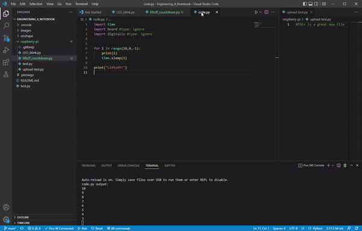

### Code
[Countdown Code](https://github.com/ABird2918/Engineering_4_Notebook/blob/main/raspberry-pi/liftoff_countdown.py) 

### Reflection

As this was the first real coding assignment this year, I experienced some difficulty when creating my coundown. Not only did I have to use a for loop, of which I had to remind myself, but I also had trouble with the range. The assignment asks for a countdown from 10 to 0 and when I was inputing the range for my countdown, I created a range from 10-0. However, that doesn't include 0 at the end of the countdown because it considers it a mission accomplished when it reaches 1. In the end, I decided to leave it this way because it seems silly to print 0 and then print liftoff because in reality, a rocket would liftoff ON 0 not AFTER 0.

&nbsp;

### Liftoff Part 2: The Lights

Next, we had to change our code to include 2 external LEDs: one red and one green. The red LED had to blink for each number in the countdown and the green LED had to turn on upon liftoff, all while still displaying the necesary information as outlined in the previous assignment in the terminal.

### Evidence 

 

### Wiring

### Code
[Lights Code](https://github.com/ABird2918/Engineering_4_Notebook/blob/main/raspberry-pi/liftoff_lights.py)

### Reflection

My code was working beautifully BUT shortly thereafter, it mysteriously quit working. After a long time looking at it but not actually changing anything, it started working again and I successfully achieved liftoff. I also had an issue putting my video into my README because my file was too big but I fixed that too. I had hesitation when I had to blink the red led because I had to put multiple sleep commands in that add up to one second but I figured that out.

&nbsp;
### Liftoff Part 3: The button

The assignment was to add a button that triggers the countdown that uses the correct LEDs and shows the correct display in the terminal as described in the previous assignments.

### Evidence 

 
### Wiring

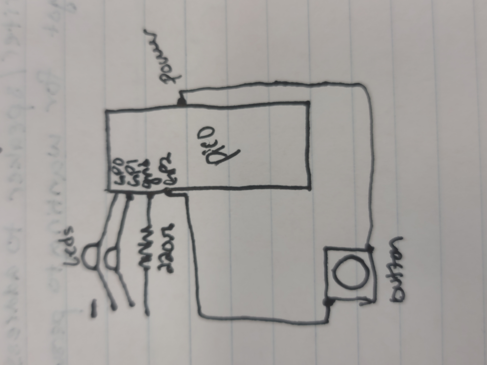

### Code
[Button Code](https://github.com/ABird2918/Engineering_4_Notebook/blob/main/raspberry-pi/liftoff_button.py)

### Reflection

The main difficulty that I faced was wiring the button. I had a lot of trouble getting my code to respond to the button even though the code seemed like it should have been working. In the end, I had the power and the pin going into the same rail on the board which meant the button wasn't actually going to respond to my code. When I fixed that, it started working immediately and I now have a functinoal button triggered countdown.

&nbsp;

### Liftoff Part 4: The servo

The extension of the assignment was to have a servo move 180 degrees upon liftoff to simulate the actual process of liftoff.

### Evidence 

### Wiring
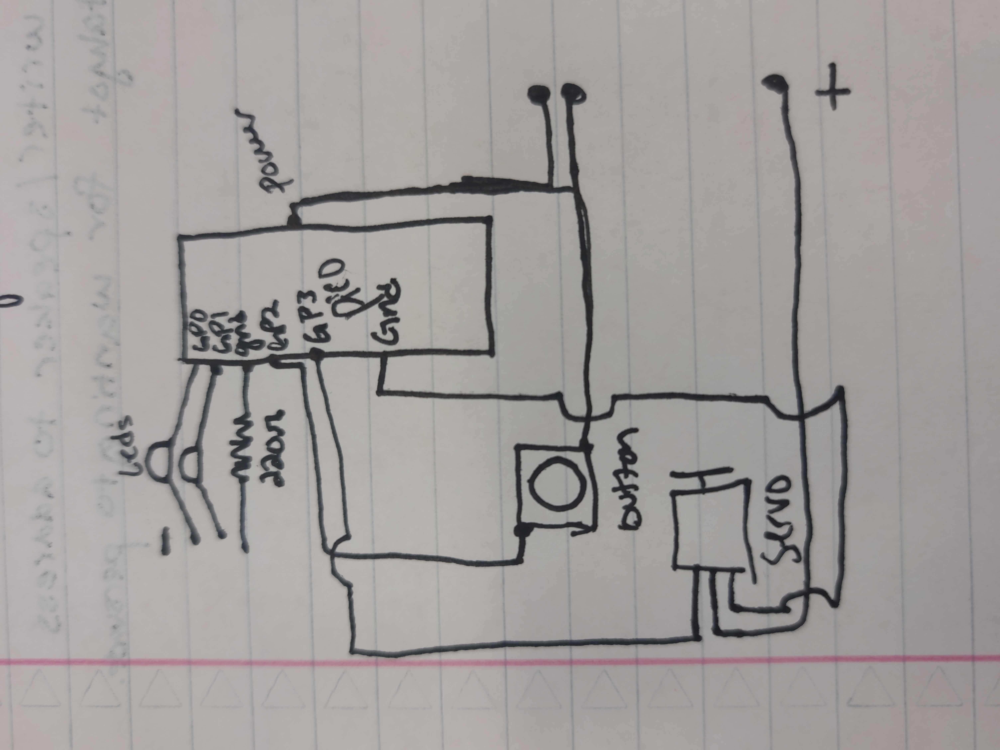
### Code
[Servo code](https://github.com/ABird2918/Engineering_4_Notebook/blob/main/raspberry-pi/liftoff_servo.py)
### Reflection

Hazel wasn't there the first day I was on this assignment so I was forced to figure it out completely by myself. I was able to figure out all of the code by myself for the first time. However, I struggled with the wiring and in the end, what was stopping me from succeeding was the fact that the ground going to my servo was going through a resistor. Also, I discovered a fun new feature of VScode when it started showing me my recent changes by displaying a very scary red triangle on the left side of the code. It turned out that it was not an emergency, just recent edits.

&nbsp;

### Crash avoidance: Part 1

Using an accelerometer, print the x, y, and z acceleration and angular velosity.

### Evidence 

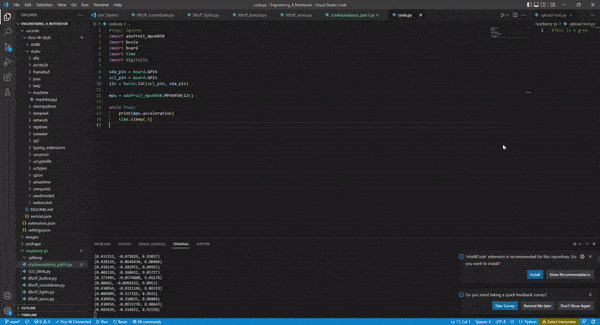

### Wiring
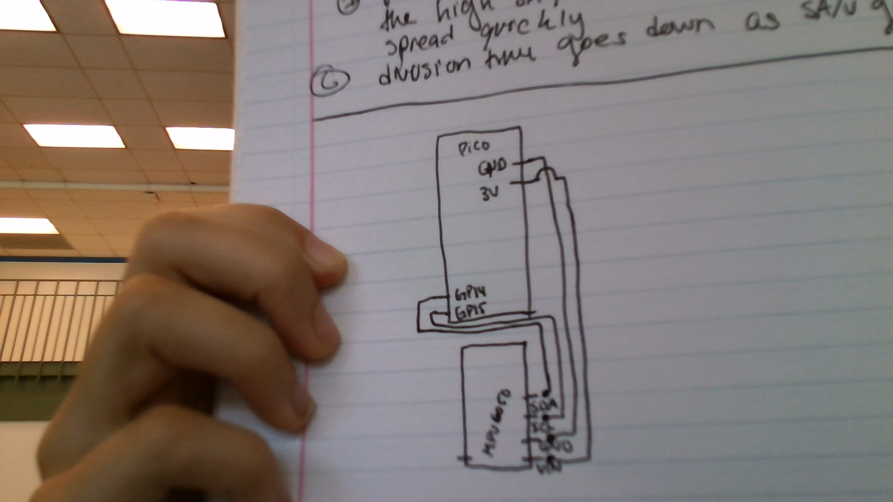
### Code
[Part 1 code](https://github.com/ABird2918/Engineering_4_Notebook/blob/main/raspberry-pi/crashavoidance_part1.py) 

### Reflection

The directions were very clear for this assignment so there was little room for error prone interpretation. The part that I had the most trouble with was when I accidentally created a new code.py file in my VS code that was unrelated to my PICO. I did that because the original code.py wasn't showing up but it turns out, if your code.py doesn't have any relationship with your Circuitpy folder, the code won't run. Don't worry though, I recovered my other code.py by plugging my PICO into the computer which I probably should have done at the beginning.

&nbsp;
### Crash avoidance: Part 2

Using an accelerometer, print the x, y, and z acceleration and angular velosity.

### Evidence 

### Wiring
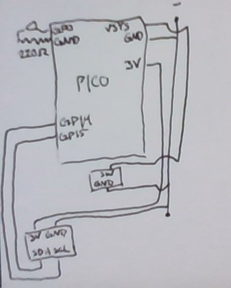
### Code
[Part 2 code](https://github.com/ABird2918/Engineering_4_Notebook/blob/main/raspberry-pi/crashavoidance_part2.py) 

### Reflection

The directions were very clear for this assignment so there was little room for error prone interpretation. The part that I had the most trouble with was when I accidentally created a new code.py file in my VS code that was unrelated to my PICO. I did that because the original code.py wasn't showing up but it turns out, if your code.py doesn't have any relationship with your Circuitpy folder, the code won't run. Don't worry though, I recovered my other code.py by plugging my PICO into the computer which I probably should have done at the beginning.

&nbsp;
### Crash avoidance: Part 3

Using an accelerometer, print the x, y, and z acceleration and angular velosity on the OLED screen.

### Evidence 

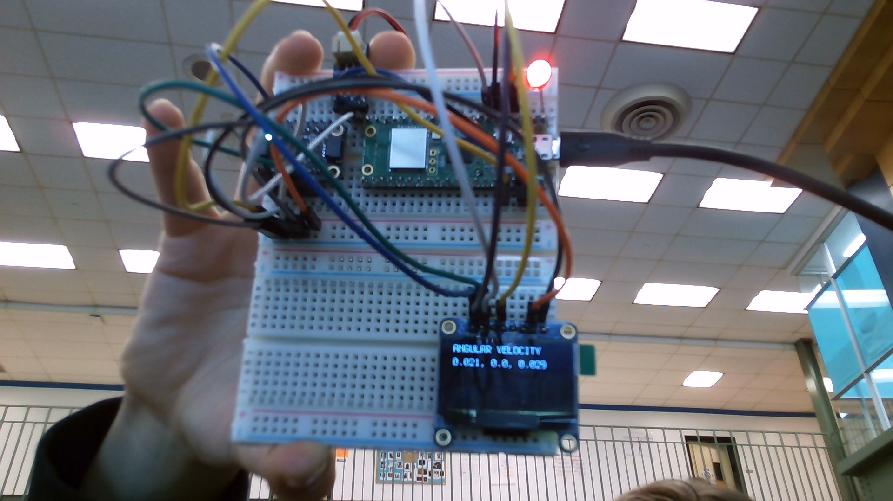

### Wiring
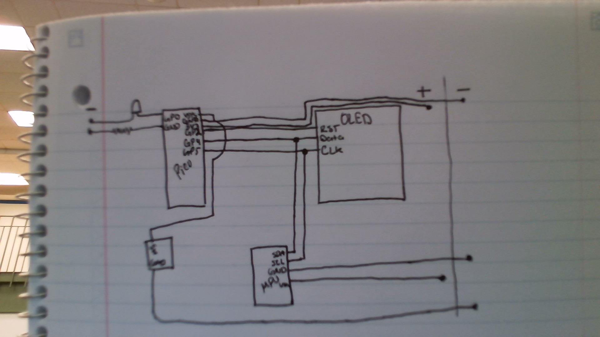
### Code
[Part 3 code](https://github.com/ABird2918/Engineering_4_Notebook/blob/main/raspberry-pi/crashavoidance_part3.py) 

### Reflection

The most easily made mistake for me this time was releasing the i2c pin BEFORE you declare where the pin goes. Second, I struggled a little with getting the OLED to move the cursor because it doesn't work like LCD displays. The wiring of the SCL and the SCL and the SDA and the SDA was weird since it had to be wired to each other in a chain like fashion.

&nbsp;
### Crash avoidance: Part 4

Using an accelerometer, print the x, y, and z acceleration and angular velosity on the OLED screen. Using an altimeter, only turn the LED on if the altitude is less than 3 meters above launch point.

### Evidence 

### Wiring
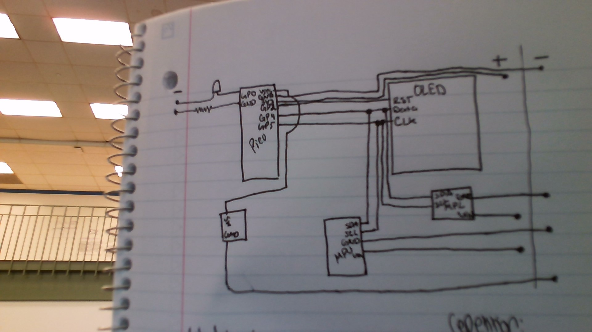
### Code
[Part 4 code](https://github.com/ABird2918/Engineering_4_Notebook/blob/main/raspberry-pi/crashavoidance_part4.py) 

### Reflection

GUESS WHAT?!?! I successfully completed a spicy assignment without help from anyone else! I hadn't actually done a code assignment this year without significant assistance from Hazel Conklin but I completed this assignment all on my own for the first time this year, all in one day. There was a funny issue with my altimeter where it didn't know what a meter was so I had to go way farther than 3 meters for it to register as 3 meters but it worked anyway. Also - apparently i2c pins don't really work and it'll throw errors at you if you haven't wired it yet. So I learned that too--wire before you get upset because vscode is insulting you.
&nbsp;
## Raspberry_Pi_Assignment_Template

### Landing Area Part 1

The assignment was to write a program that takes input coordinates and calculates the area of the triangle bound by those coordinates. If the format is incorrect on the input, the program will tell the user to input it correctly.

### Evidence 

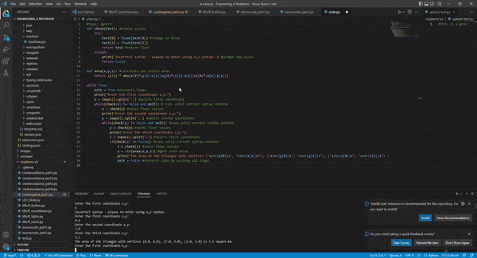 

### Code
[Part1 code](https://github.com/ABird2918/Engineering_4_Notebook/blob/main/raspberry-pi/Landingarea_part1.py)

### Reflection

The hardests parts of this assignment included input loops and figuring out how to correct incorrect formatting. Additionally, going back and forth between strings and floats caused problems. In the end we were able to get all of those together in order to properly format the input and the output.

&nbsp;
### Landing Area Part 2

The assignment was to write a program that takes input coordinates and calculates the area of the triangle bound by those coordinates. If the format is incorrect on the input, the program will tell the user to input it correctly. The triangle will be printed on the OLED screen.

### Evidence 

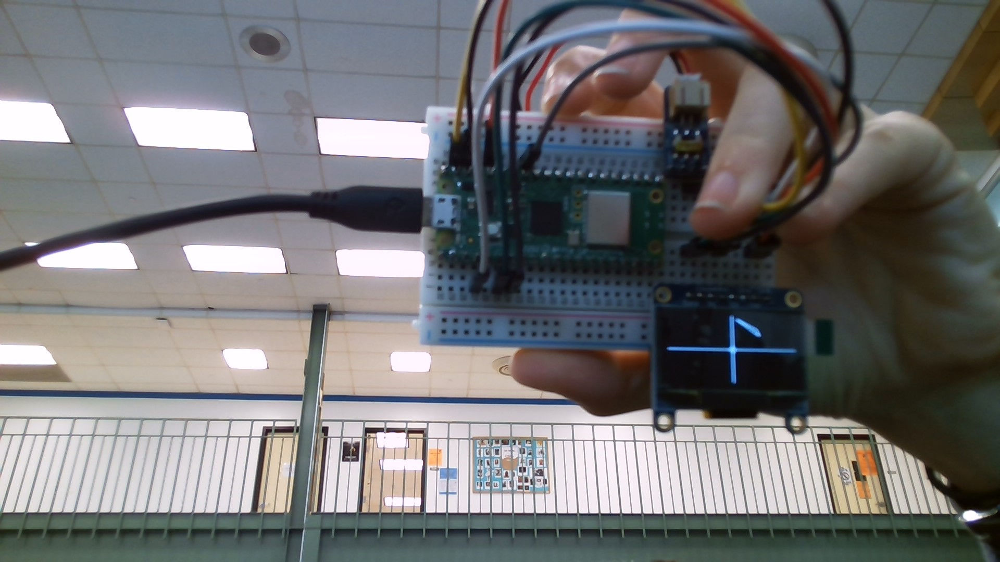 
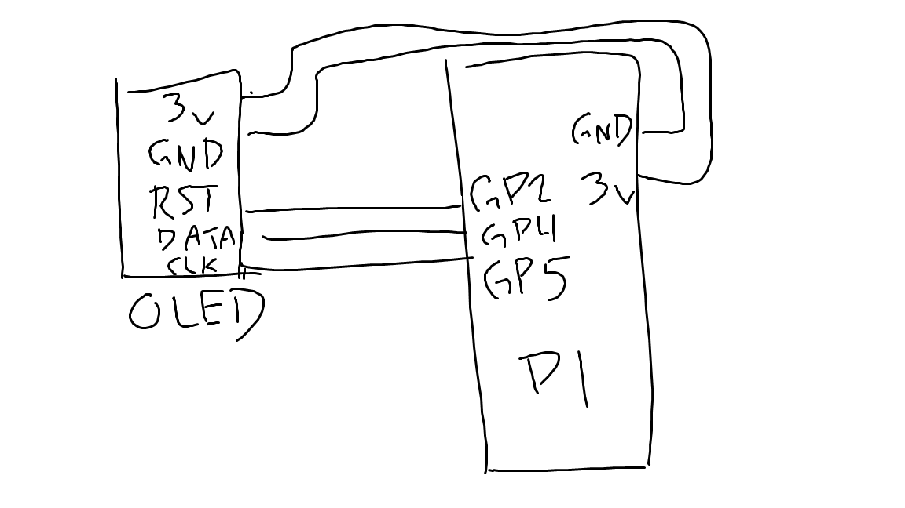

### Code
[Part 2 code](https://github.com/ABird2918/Engineering_4_Notebook/blob/main/raspberry-pi/landingarea_part2.py)

### Reflection

This assignment was a remix of part one but had some questionable components including putting triangle at the origin. That was tricky. Additionally, it required an OLED which was a friendly call back to a our favorite previous assignment so I was able to improv the OLED code successfully. 

&nbsp;
### Morse code part 1

The assignment was to create a translator for english to morse code. It takes input text in english and gives the output of the morse code.

### Evidence 

 

### Code
[Part 2 code](https://github.com/ABird2918/Engineering_4_Notebook/blob/main/raspberry-pi/landingarea_part2.py)

### Reflection

This assignment was a remix of part one but had some questionable components including putting triangle at the origin. That was tricky. Additionally, it required an OLED which was a friendly call back to a our favorite previous assignment so I was able to improv the OLED code successfully. 

&nbsp;
## Onshape_Assignment_Template

### FEA Beam Part 1

The assignment was to design a beam that weighs less than 13 grams and fits without modifying the connection block Mr. Miller made in order to hold as much weight as possible off of a surface. The materials must be PLA with no overhang.

### Part Link 

[Part link](https://cvilleschools.onshape.com/documents/9038cb34a59f90ef5226b7fe/w/995d5394430dd0e4e411f47a/e/81684d3986b9792771074cb9?renderMode=0&uiState=651d6913c9903a610100dc53).

### Part Image

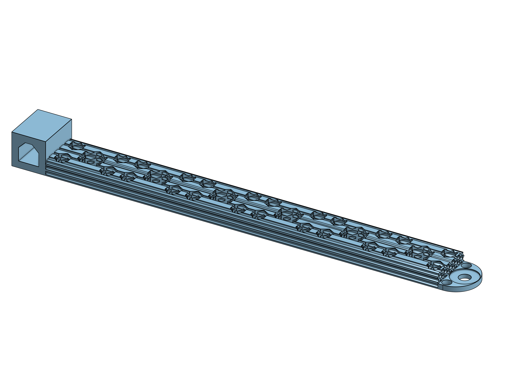

### Reflection

We thought the honeycomb pattern would work best to support the beam. We cut out hexagons along the center of the beam but found that the beam was still much too heavy. We needed to cut off 8 grams of the weight to get it under 13 grams for the assignment so we cut hexagons from the top through the bottom of the beam. We also filleted certain points and cut off excess material and we were able to get it down to 12.99 grams. Beause we cut so many holes, there is a good chance it will break easily and when it does it will probably shatter. We won't forget our safety goggles.

&nbsp;
### FEA Beam Part 2

The assignment was to run a force simulation on the beam to predict the amount of force it can hold. Then we were to analyze the results and identify the parts of our beam that were experiencing the most relative stress.

### Part Link 

[Part link](https://cvilleschools.onshape.com/documents/9038cb34a59f90ef5226b7fe/w/995d5394430dd0e4e411f47a/e/81684d3986b9792771074cb9?renderMode=0&uiState=651d6913c9903a610100dc53).

### Part Image

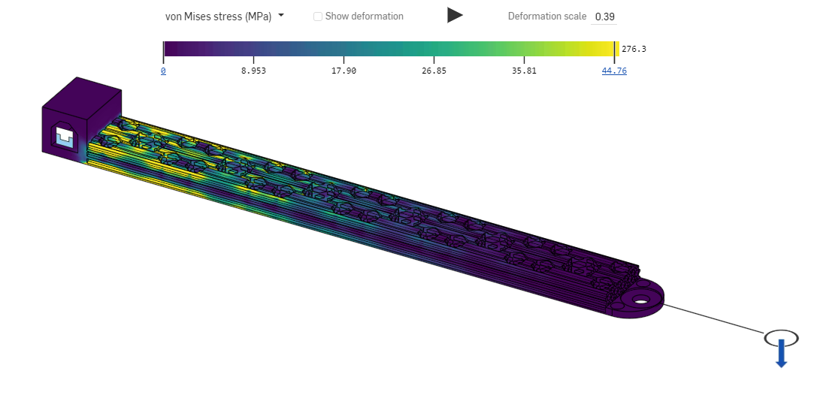

### Reflection

The aspects of our beam that experienced the most stress were the ones closest to the holder. The joint between the holder attachment and the beam was experiencing so much stress that it was unlikely to really hold very much weight before snapping. Our plan for reinforcing them by adding a slant to our design. We take material away from the end of the beam and put it at the base.

&nbsp;
### FEA Beam Part 3

The assignment was to improve the beam and simulate again to create a better beam than our first test.

### Part Link 

[Part link](https://cvilleschools.onshape.com/documents/9038cb34a59f90ef5226b7fe/w/995d5394430dd0e4e411f47a/e/81684d3986b9792771074cb9?renderMode=0&uiState=65313d091fda9532bd763284).

### Part Image

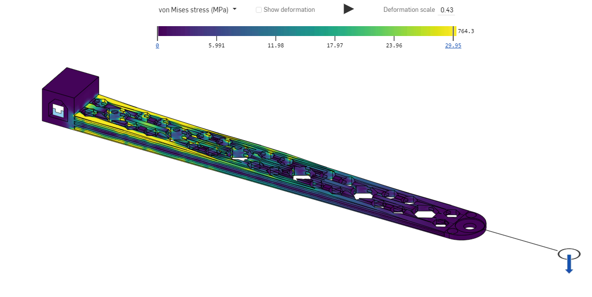

### Reflection

We evaluated that the weakest point in our last assignment was the joint between the holder and the beam and so we beefed up material at that joint and took material away from the end. Hopefully, the beam will withold a lot more stress given that the point that experiences the most stressed has been emphasized. Overall, I do not have high hopes about the function of this beam because the best designs seem to be oriented like an I beam. Nevertheless, we are going to strive for creativity points and I personally love the honeycomb.

&nbsp;

## Media Test

Your readme will have various images and gifs on it. Upload a test image and test gif to make sure you've got the process figured out. Pick whatever image and gif you want!

### Test Link

[test.py](raspberry-pi/test.py)

### Test Image

### Test GIF

